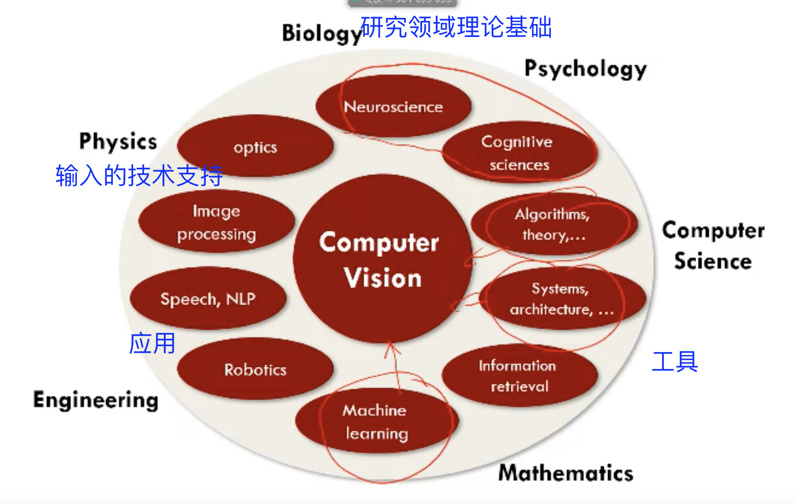
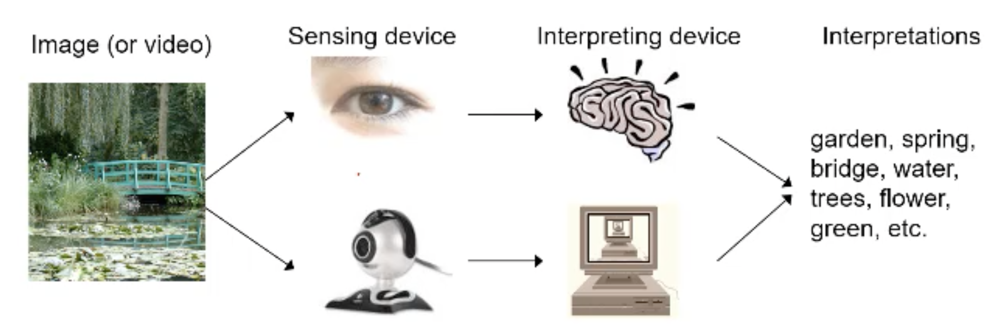
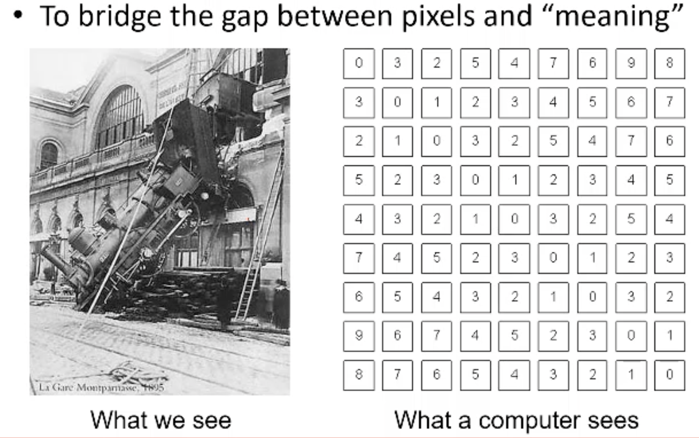
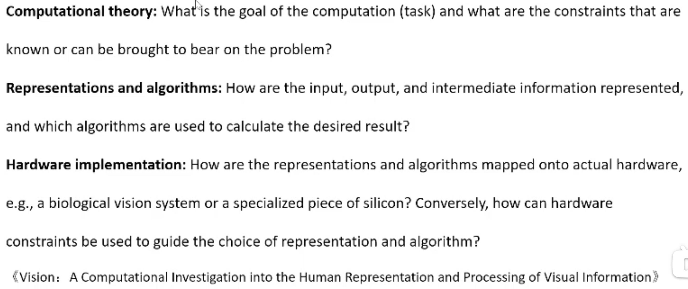
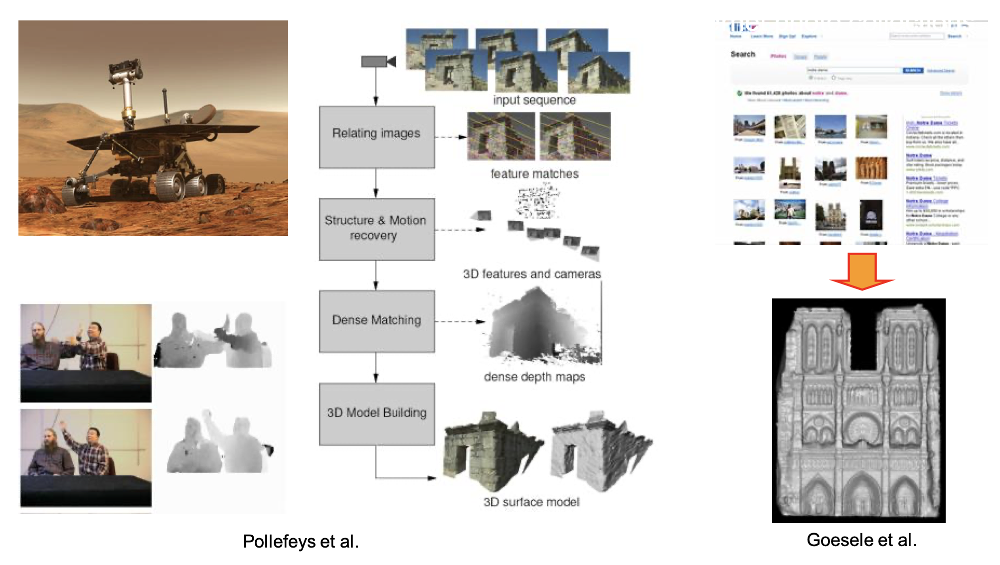
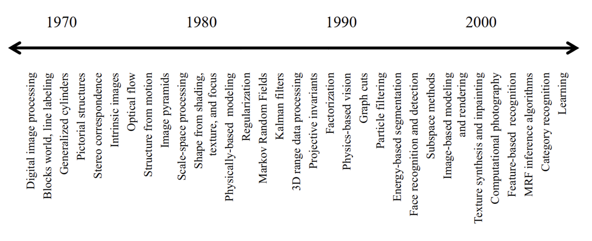
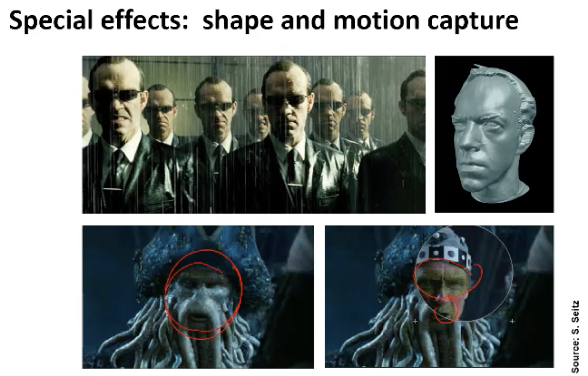
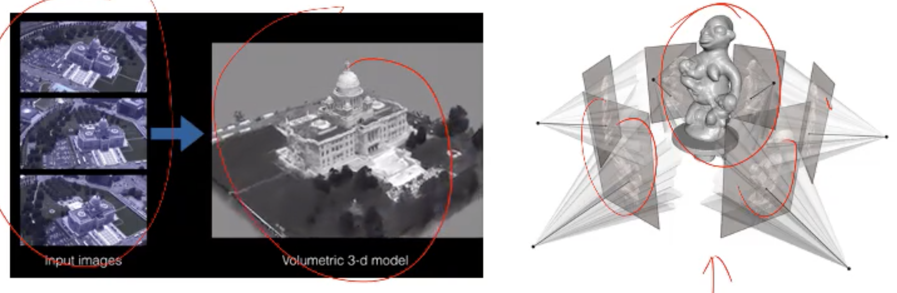
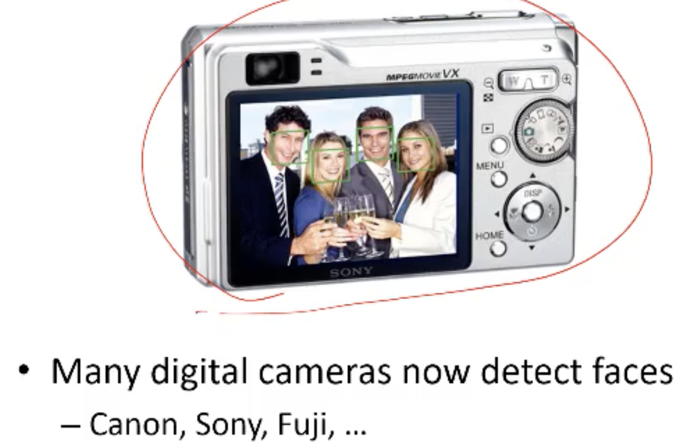
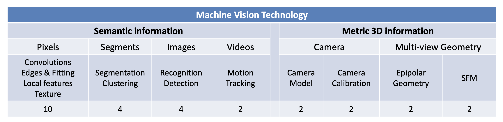

# P1-Introduction

## Intro about CV

<!--more-->

- VS
  - 计算机视觉：输入图像，输出语义
  - 图像处理：输入图像，输出图像

- 视觉系统：图像->感知->解析->答案
  - 

- 计算机视觉目的：从像素矩阵中读取内容
  - 

### 人类视觉系统

- 人类视觉系统特点
  - 大脑皮层神经元与视觉识别关系：表层粗糙识别，深部精细识别
  - 识别速度快
  - 变化视盲，可以快速识别但识别精度低
  - 利用上下文和背景知识经验理解

### 机器视觉系统

- Pioneer in CV Field: David Marr
  - CV结构
    - 计算机理论：计算机视觉时做什么的？受到什么的约束？
    - 表示和算法：输入/输出/中间的信息如何表示？什么样的算法可以达到预期结果
    - 硬件实现：如何将表示和算法映射到硬件上？如何将硬件的限制用于指导表示和算法的选择

## CV的应用和发展

- 可以从一张图片中提取出什么信息
  - 3D 信息
  - 语义(Semantic)信息
- CV相关设备应用
  - 
  - SLAM：同时建图和定位，通过视觉图像信息推断出三维信息，应用于无人驾驶
  - 图片建模
  - 多图像的三维重建方法
  - 语义识别

- CV发展方向
  - 
  - 大方向：三维重建&图像识别
  - 发展
    - 70s：几何图像识别
    - 80s：数学方法介入，eg提取边缘，通过阴影推测图像
    - 90-00s：机器学习介入，从图像中找到信息并做决策
    - 10s：深度学习介入

- 应用
  - 面部捕捉
    - 
  - 三维重建
    - 
    - 扫地机器人
  - 人脸检测
    - 
  - 笑脸识别
  - 人脸识别解锁
  - 虹膜识别
    - 难点：将采集到的虹膜展开成矩形
  - 指纹识别：通过比较指纹断点和转弯处
  - 手写体识别

## CV学术&工业界

- Become a vision researcher
  - CVPR 2020 conference
  - ICCV 2020 conference
- Become a vision engineer in industry – Perception team at Google AI
  - Vision at Google Cloud
  - Vision at Facebook AI
  - Vision at SenseTime
  - Vision at MEGVII
  - Vision at Tencent AI Lab

## Course Overview

 
